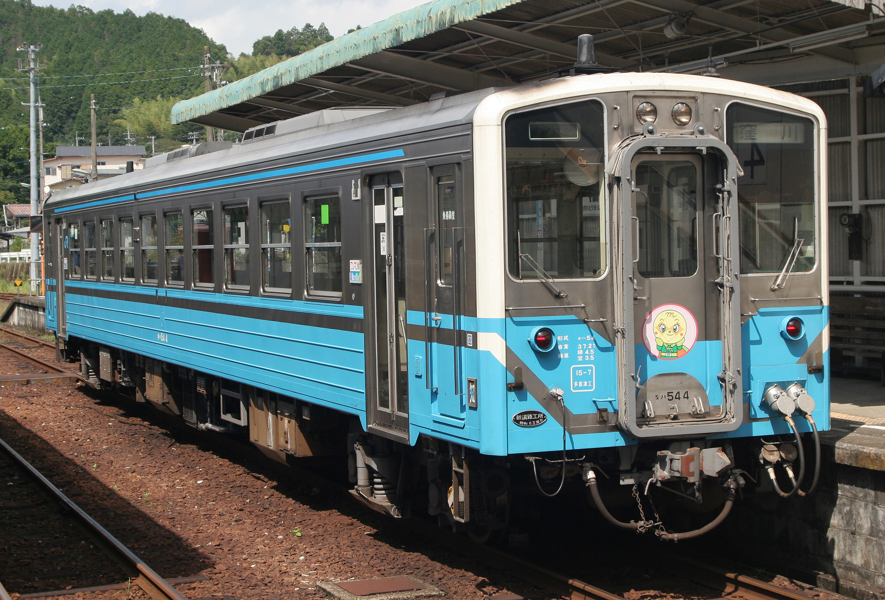
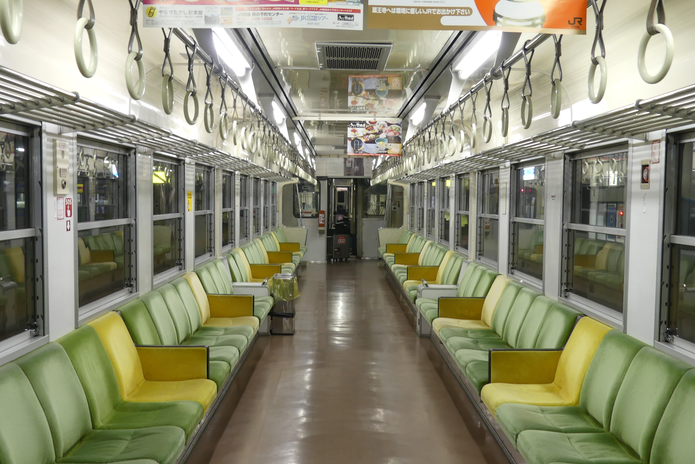
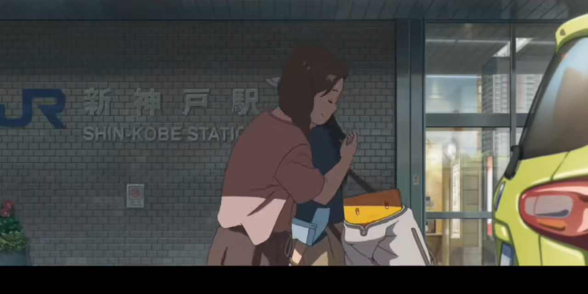
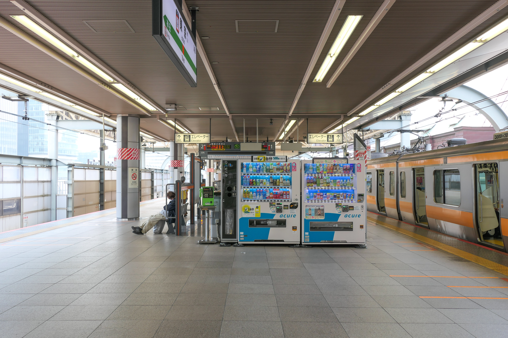

本文档整理了电影《铃芽之旅》中出现过的电车车型以及相关信息。该仓库持续更新中，可能无法包含所有信息，还请见谅，欢迎大家pull requests补充。

1. JR四国 予赞线

   * 予赞线 Kiha54 型 0 番台柴油动车组 （*気動車*），1986年首次出厂，此涂装为 JR 四国涂装。<!-- https://ja.wikipedia.org/wiki/%E5%9B%BD%E9%89%84%E3%82%AD%E3%83%8F54%E5%BD%A2%E6%B0%97%E5%8B%95%E8%BB%8A -->   
    <!-- https://commons.wikimedia.org/wiki/File:JRS_kiha54-4.jpg；作者：Mitsuki-2368；CC-BY-SA 3.0 许可 -->
   * 根据侧面鲜艳的四国涂色和 10 个可开闭车窗，以及前后带全尺寸窗的车门，可以确定该车为 Kiha54。
 
 <!-- https://commons.wikimedia.org/wiki/File:JRS-Kiha54-Inside.jpg；作者：MaedaAkihito；CC-BY-SA 4.0 -->
   * 旁边的车门可以看出是Kiha54。影片还原非常到位，扶手板甚至座椅的颜色都可以说是一模一样。
2. 东海道 · 山阳新干线
影片中，铃芽与椅子形态的草太，在 JR 西日本的**新神户站**乘坐**东海道新干线**，前往东京。
<!-- https://commons.wikimedia.org/wiki/File:Shin-Kobe_Station_exterior_2019-11-15_(49765712066).jpg；作者：Cheng-en Cheng；CC-BY-SA 2.0 许可 -->   
   * 电影中的位置，对应第一张照片的左下角那一处
   * <!-- https://commons.wikimedia.org/wiki/File:Series-N700S-J2.jpg；作者：MaedaAkihito；CC-BY-SA 4.0 -->
3. 中央快速线 东京站（站台）

铃芽与椅子形态的草太由此乘车前往同一线路的御茶之水站。此站为中央快速线的终点站，两边站台交替发车，影片中草太提醒铃芽左边站台先发车。